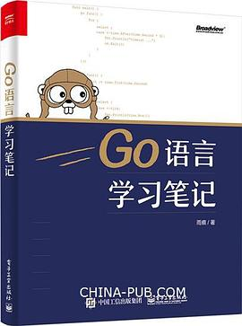
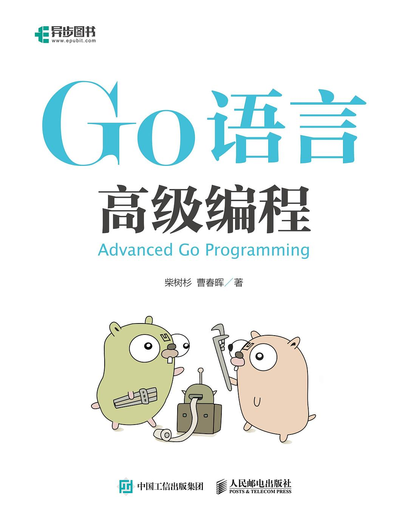
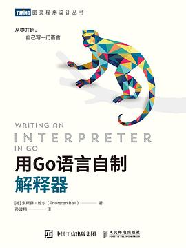
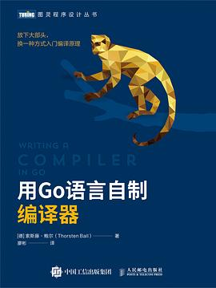

## 1. What is Go?

## 2. Blogs

## 3. Projects

## 4. Courses

| #    | Course Link                                                  | Sources          |
| ---- | ------------------------------------------------------------ | ---------------- |
| 1    | [Tony Bai · Go 语言第一课](https://time.geekbang.org/column/intro/100093501) | 【极客时间】专栏 |
|      |                                                              |                  |
|      |                                                              |                  |
|      |                                                              |                  |

## 5. Books

| #    | Name                   | Link                                                         | Resouces |
| ---- | ---------------------- | ------------------------------------------------------------ | -------- |
| 1    | **Go语言实战**         |    |          |
| 2    | **Go语言学习笔记**     |  |          |
| 3    | **Go语言高级编程**     |  |          |
| 4    | **Go语言精进之路**     |  |          |
| 5    | **Go语言设计与实现**   |  |          |
| 6    | **用Go语言自制解释器** |  |          |
| 7    | **用Go语言自制编译器** |  |          |

### 

### 

### 

### 

### 

### 

### 